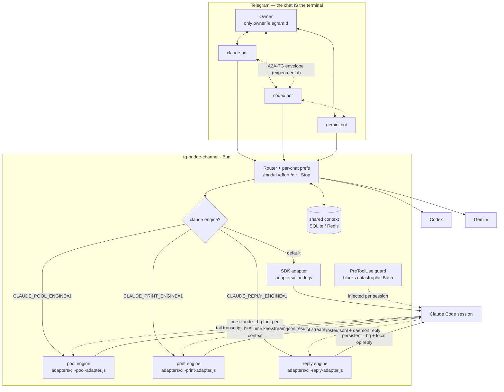

<div align="center">

# tg-bridge-channel

**Self-hosted Telegram bridge for AI coding agents — the chat IS the terminal.**

*Drive Claude Code / Codex / Gemini from a Telegram chat through SDK or local CLI engines, with the A2A-TG envelope protocol for multi-agent collaboration in group chats.*

[](LICENSE)
[](https://bun.sh)
[](https://telegram.org/)

**English** | [简体中文](README_CN.md)

</div>

---

## What it is

`tg-bridge-channel` runs AI coding agents as Telegram bots. Each bot is a full agent session you talk to from your phone or desktop — the chat *is* the terminal. It supports three modes:

- **Single-agent control** — one Claude Code / Codex / Gemini session per bot, driven over Telegram.
- **Parallel sessions** — N independent bots in one group, each its own session, with shared context (SQLite/Redis).
- **Heterogeneous multi-agent collaboration** _(experimental, disabled by default — set `a2aEnabled` to opt in)_ — Claude, Codex, and Gemini bots talking to each other in a group via the A2A-TG envelope protocol, with generation-counted loop suppression.

The **primary, battle-tested path** is single-agent private-chat control of Claude Code via the pool engine below. Parallel sessions and A2A collaboration work but are experimental; the Gemini backend and the `local-agent` executor are compatibility layers that see far less real-world use.

## Architecture



## Engine layer

The `claude` backend ships four engine implementations. Environment-variable priority is reply → print → pool → SDK:

| Mode | Implementation | How it works | Status |
|---|---|---|---|
| default | `adapters/claude.js` | Programmatic adapter built on the [Claude Agent SDK](https://docs.anthropic.com/en/docs/agents-and-tools/claude-code/agent-sdk). | Fallback / API-billed path |
| `CLAUDE_POOL_ENGINE=1` | `adapters/cli-pool-adapter.js` | Per-**turn** `claude --bg [--resume]` workers; output is tailed from the forked transcript. | Primary owner-used CLI path |
| `CLAUDE_PRINT_ENGINE=1` | `adapters/cli-print-adapter.js` | `claude --print --output-format stream-json [--resume]`; no daemon reply socket. | Experimental |
| `CLAUDE_REPLY_ENGINE=1` | `adapters/cli-reply-adapter.js` | Persistent `claude --bg` worker plus an authenticated local daemon `op:reply`. | Experimental; highest upgrade coupling |

The pool engine spawns one short-lived `claude --bg` worker **per turn**: each inbound Telegram message launches `claude --bg [--resume <session-id>] "<prompt>"`, which forks a new session inheriting the full conversation history, streams the reply back by tailing the forked session's local transcript file, and stops the worker when the turn completes. The bridge persists the forked session id per chat and resumes it on the next message, so the conversation stays continuous across turns. Per-chat `/model`, `/effort` and `/dir` preferences plus the bridge's system-prompt scaffold are passed to every spawn as plain CLI flags.

Two practical caveats of the fork-per-turn design:

- **Quota grows with conversation length.** Every turn re-forks the full history, so very long conversations consume subscription usage superlinearly. Start a fresh session (`/new`) when switching topics.
- **Silence isn't a hang, and a timeout doesn't kill the task.** When a long-running task goes quiet for more than `CLI_POOL_HEARTBEAT_MS` (default 3 min), the bridge keeps emitting a "still running" heartbeat instead of declaring failure; only when the turn's total duration exceeds `CLI_POOL_HARD_LIMIT_MS` (default 60 min) does it report a hard timeout — and even then it deliberately leaves the worker running, so its output keeps landing in the session transcript and your next message forks from that same session and inherits everything written in the meantime. Normal completion and the Stop button still stop the worker immediately.

The backend name stays `claude` in all four modes, so all orchestration (`backendName === "claude"` checks for approval / labels / A2A / cron) is unchanged. Switching engines is a per-process environment variable; rolling back is removing it.

> The pool engine invokes documented Claude CLI commands, but reply discovery and completion detection also depend on **observed local implementation contracts**: the `backgrounded · <short-id>` stdout line, `~/.claude/daemon/roster.json`, `~/.claude/projects/<encoded-cwd>/<session-id>.jsonl`, user/assistant record shapes, and either visible-text `end_turn` or `system.turn_duration`. These are not a stable public API. A Claude Code upgrade can therefore break the bridge even when `claude --bg` itself still exists.

> An earlier interactive channel-plugin engine (`CLAUDE_CHANNEL_ENGINE=1`) used a local Model Context Protocol server modeled on Claude Code's built-in fakechat channel. It was removed in May 2026 in favor of the Agent View based pool engine; see git history before May 2026 for the channel-plugin engine implementation.

### Claude Code compatibility boundary

| Engine | Documented surface used | Observed / internal contract also used | Upgrade posture |
|---|---|---|---|
| SDK | Published Agent SDK event stream | Local transcripts are consulted for session discovery and resume-noise repair | SDK version pin and regression tests |
| print | `--print`, `--resume`, `--output-format stream-json`, `--settings` | Exact stream-json message/result shapes and local persisted sessions | Synthetic event/result fixtures; no direct roster/socket contract |
| pool | `--bg`, `--resume`, `claude stop`, `--settings` | Background stdout short ID, daemon roster schema, transcript path/records, two turn-end forms | Synthetic roster/transcript fixtures plus optional live startup self-check |
| reply | The same background CLI commands | Everything in pool, plus `control.sock`, a non-empty `control.key` file, and the daemon `op:reply` protocol | Experimental; expect breakage when daemon internals change |

The last **static** compatibility check in this repository was against Claude Code **2.1.211 on 2026-07-17**. That means the required CLI help surfaces were present and the synthetic contract fixtures matched the parser; it is not a promise that all future Claude Code versions work.

`/doctor` performs a non-invasive structural check for the selected engine. It checks required flags, roster shape, transcript-directory presence, and—only for reply mode—whether `control.key` is a non-empty regular file; it never reads or prints the key. For enabled CLI engines, the delayed startup self-check is the live end-to-end check (`spawn → roster/stream → transcript/result → stop`). It consumes a small Claude turn and can be disabled with `POOL_SELF_CHECK=0`.

## Quick start

```bash
# 1. install dependencies
bun install

# 2. configure
cp config.example.json config.json
# edit config.json: set ownerTelegramId and backends.<engine>.telegramBotToken

# 3. run (default SDK engine)
bun run start --backend claude --config config.json
```

To run the **pool engine** (recommended; subscription-billed background sessions):

```bash
CLAUDE_POOL_ENGINE=1 bun run start --backend claude --config config.json
```

## Multi-instance

Each bot instance uses its own config file (`config.json`, `config-2.json`, …) with a distinct bot token and sessions database. Launch agent templates for always-on operation live in `launchd/`.

## Configuration

See `config.example.json` for the full schema. Key fields:

- `ownerTelegramId` — only this user can drive the bot.
- `backends.<claude|codex|gemini>.telegramBotToken` — bot token per backend.
- `sharedContextBackend` — `sqlite` or `redis` for cross-bot shared memory.
- `outputRelayTrustedChatIds` — group chats allowed to receive generated file attachments. Empty by default; even listed groups require the owner to trigger the turn.
- `a2aEnabled` / `a2aPorts` — enable A2A-TG inter-bot messaging.

## Security

Automatic file attachments are enabled for owner-triggered private chats. Group attachments are disabled unless the group ID is listed in `outputRelayTrustedChatIds`, and bot-triggered Discuss turns never send local files. Every detected path—whether reported by a tool event or found in model text—must resolve to a regular, non-hidden file inside that turn's working directory. Common credential/config/log names, symlink escapes, the inbound upload directory, unsupported types, and files over 20 MB are rejected before reading.

The `claude --bg` engine runs with `--permission-mode bypassPermissions`, so the bot never stalls on permission prompts. To stop that from meaning "the bot will run anything", every `--bg` worker is launched with an injected `PreToolUse` hook (`scripts/guard-destructive-bash.sh`) that hard-blocks a small set of catastrophic, irreversible Bash commands: recursive deletion of `/`, `~`, `$HOME` or a top-level system directory; `mkfs`; `dd` onto a block device; redirecting onto a block device; fork bombs; and `shred` of a device. Everyday commands — including `rm -rf node_modules` — pass untouched.

The hook is injected per session via `--settings` (inline JSON), so it never touches your own `~/.claude/settings.json`. Set `CLI_POOL_DESTRUCTIVE_GUARD=0` to disable it (not recommended for public-facing deployments).

This is a hand brake, not a sandbox: the blocklist only catches straightforward forms and can be bypassed by obfuscated commands (`base64 -d | sh`, variable splicing, spawning a subprocess). For real isolation, run the bot in a container, under a restricted account, or with a constrained working directory.

## A2A-TG protocol

The inter-bot envelope protocol is specified in [docs/a2a-tg-v1.md](docs/a2a-tg-v1.md). It is inspired by — but not compatible with — the official [A2A protocol](https://a2a-protocol.org); it adds generation-based loop suppression and chat-scoped idempotency for the IM scenario.

## Tests

```bash
bun test
bun run check:claude-contract
```

## Ecosystem

- [telegram-ai-bridge](https://github.com/AliceLJY/telegram-ai-bridge) — original Telegram bridge using A2A-TG protocol
- [wechat-ai-bridge](https://github.com/AliceLJY/wechat-ai-bridge) — same idea on WeChat
- [recallnest](https://github.com/AliceLJY/recallnest) — shared memory MCP across Claude/Codex/Gemini

## License

MIT — see [LICENSE](LICENSE).
