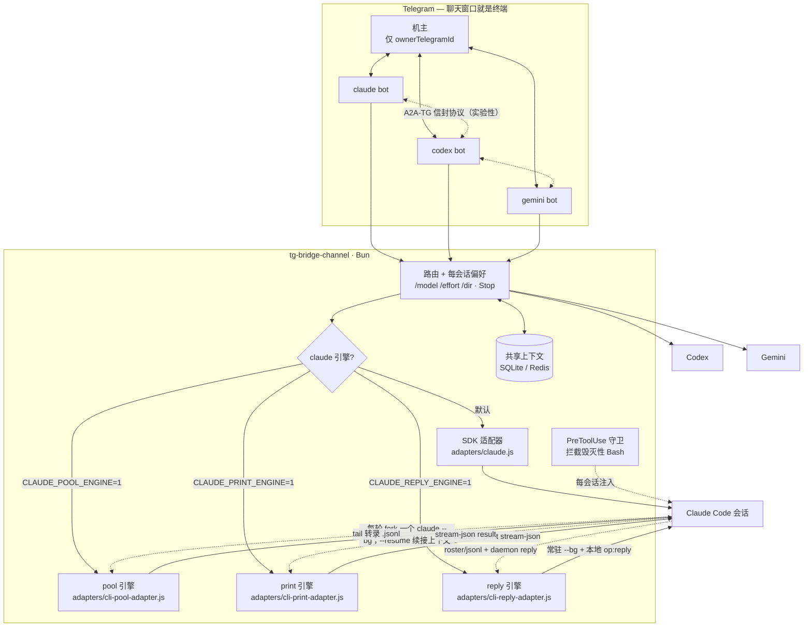

<div align="center">

# tg-bridge-channel

**自托管的 Telegram AI 编程代理桥 —— 聊天窗口就是终端。**

*在 Telegram 聊天里通过 SDK 或本地 CLI 引擎驱动 Claude Code / Codex / Gemini，并通过 A2A-TG 信封协议支持群聊内多代理协作。*

[](LICENSE)
[](https://bun.sh)
[](https://telegram.org/)

[English](README.md) | **简体中文**

</div>

---

## 这是什么

`tg-bridge-channel` 把 AI 编程代理跑成 Telegram bot。每个 bot 是一个完整的代理会话，你从手机或桌面跟它对话 —— 聊天窗口就是终端。支持三种模式：

- **单代理控制** —— 每个 bot 一个 Claude Code / Codex / Gemini 会话，通过 Telegram 驱动。
- **并行会话** —— 一个群里跑 N 个独立 bot，各自独立会话，带共享上下文（SQLite/Redis）。
- **异构多代理协作**（实验性，默认关闭，需置 `a2aEnabled` 开启）—— Claude、Codex、Gemini bot 在群里通过 A2A-TG 信封协议互相对话，带基于代际计数的环路抑制。

**主路径**（经过日常实际使用打磨的部分）是私聊单代理控制 Claude Code + 下方的 reply 引擎（2026 年 6 月之前这个位置是 pool 引擎，现保留作回滚路径）。并行会话和 A2A 协作可用但属实验性质；Gemini 后端和 `local-agent` 执行器是兼容层，实际使用频率低得多。

## 架构



## 引擎层

`claude` 后端有四套引擎实现。环境变量优先级为 reply → print → pool → SDK：

| 模式 | 实现 | 工作方式 | 状态 |
|---|---|---|---|
| 默认 | `adapters/claude.js` | 基于 [Claude Agent SDK](https://docs.anthropic.com/en/docs/agents-and-tools/claude-code/agent-sdk) 的程序化适配器。 | fallback / API 计费路径 |
| `CLAUDE_POOL_ENGINE=1` | `adapters/cli-pool-adapter.js` | 每个 **turn** 一个 `claude --bg [--resume]` worker，通过 tail fork 会话记录读回输出。 | 已被 reply 取代；保留作回滚路径 |
| `CLAUDE_PRINT_ENGINE=1` | `adapters/cli-print-adapter.js` | `claude --print --output-format stream-json [--resume]`，不接 daemon reply socket。 | 已被 reply 取代；headless，因而无 remote control |
| `CLAUDE_REPLY_ENGINE=1` | `adapters/cli-reply-adapter.js` | 常驻 `claude --bg` worker，加本地 daemon 鉴权 `op:reply`。 | **机主日常使用的主要 CLI 路径**（2026 年 6 月起）；升级耦合最高 |

### 为什么有三套 CLI 引擎，以及为什么最后是 reply

前两代各解决了一半问题：

| 引擎 | 每 chat 一个会话？ | 能被 Claude remote control 接管？ | 卡在哪 |
|---|---|---|---|
| pool | 否——`--bg --resume` **每轮 fork 出新 session id** | 能（worker 带 PTY） | 每轮留下一个 `tg-turn-*` 会话记录 |
| print | 是——`--print --resume` 原地 append | 不能——headless 无 TTY | 进不了 daemon 的 remote control 名册 |
| **reply** | 是 | 能 | —— |

Claude 的 remote control 要求 TTY + 常驻进程，所以在 reply 引擎之前，"不 fork"和"手机 app 能接管"是互斥的。

**reply 引擎**为每个 chat 保持**一个常驻 `claude --bg` worker**：首条消息 spawn 它，之后每条消息通过本地 daemon 鉴权 `op:reply` 投进同一会话，因此不发生 fork、每个 chat 只有一个会话记录文件。若 daemon 已按 idle 回收该 worker（或 bridge 重启过），下条消息用 `--bg --resume <session-id>` 复活会话——这条路径**会** fork 一次，但只发生在闲置之后，不是每轮。输出侧从记录的 offset tail 同一个会话文件。

**pool 引擎**（前一代，仍是回滚路径——且 reply 引擎复用了它的 `buildTurnArgs` / 会话记录 tail / roster 工具）为**每条消息**起一个短命的 `claude --bg` worker：入站 Telegram 消息触发 `claude --bg [--resume <session-id>] "<prompt>"`，fork 出一个继承全部对话历史的新 session，通过 tail 该 session 的本地对话记录文件流式读回输出，turn 结束后停掉 worker。bridge 按 chat 持久化 fork 出的 session id、下条消息继续 resume 它，对话因此跨 turn 连续。所有引擎下，每 chat 的 `/model`、`/effort`、`/dir` 偏好和 bridge 的系统提示框架都以普通 CLI flag 形式注入每次 spawn。

两个实际代价：

- **配额随对话长度递增——仅 fork-per-turn（pool）。** 每个 turn 都带全部历史重新 fork，很长的对话会超线性消耗订阅用量。切换话题时用 `/new` 开新会话。reply 引擎不逐轮重发历史，不受影响。
- **静默不等于卡死，超时也不杀任务——所有 CLI 引擎。** 长任务静默超过 `CLI_POOL_HEARTBEAT_MS`（默认 3 分钟）时，bridge 持续发"还在跑"的心跳而非判失败；只有这一轮总时长超过 `CLI_POOL_HARD_LIMIT_MS`（默认 60 分钟）才报硬超时，且**刻意不停掉 worker**——任务继续跑、产出继续写进 session 记录，你下一条消息会继承这期间写入的一切。正常完成和 Stop 按钮仍会立即停掉 worker。

reply 独有的可调项：`CLI_REPLY_ROSTER_WAIT_MS`（默认 30 秒）是复活会话时等 daemon 注册新 session id 的时长——大会话要先加载完整历史才会出现那个 id，值设得太低会让 bridge **静默退化成新会话、丢掉上下文**。`CLI_REPLY_ECHO_GRACE_MS`（默认 90 秒）是"`op:reply` 被接受但始终没有产出"的看门狗上限。

四种模式下后端名都保持 `claude`，所以所有编排逻辑（审批 / 标签 / A2A / cron 的 `backendName === "claude"` 判断）不变。切换引擎是进程级环境变量；回滚就是删掉它。

> 三套 CLI 引擎调用的都是 Claude CLI 明文提供的命令，但发现 reply 和判断 turn 结束还依赖一组**实测所得的本地实现契约**：stdout 中的 `backgrounded · <short-id>`、`~/.claude/daemon/roster.json`、`~/.claude/projects/<encoded-cwd>/<session-id>.jsonl`、user/assistant 记录形态，以及"带可见正文的 `end_turn`"或 `system.turn_duration` 两种结束信号。reply 引擎还额外依赖 daemon 的 `control.sock`、其 `control.key` 鉴权，以及 `op:reply` 协议本身。这些都不是稳定的公开 API；即使 `claude --bg` 仍存在，Claude Code 升级也可能让 bridge 失配——这正是保留 pool 和 print 而不删除它们的原因。

> 之前的交互式 channel-plugin 引擎（`CLAUDE_CHANNEL_ENGINE=1`）通过一个仿照 Claude Code 内置 fakechat channel 的本地 Model Context Protocol server 驱动。该引擎已于 2026 年 5 月被基于 Agent View 的 pool 引擎替代；旧实现见 git history（`adapters/claude-channel.js`、`agent/channel-marketplace/`）。

### Claude Code 兼容边界

| 引擎 | 使用的公开表面 | 同时依赖的实测 / 内部契约 | 升级策略 |
|---|---|---|---|
| SDK | 已发布的 Agent SDK 事件流 | 会话发现和 resume 噪声修复仍会读取本地会话记录 | 固定 SDK 版本并跑回归测试 |
| print | `--print`、`--resume`、`--output-format stream-json`、`--settings` | stream-json 的具体 message/result 形态和本地持久化会话 | 合成 event/result fixture；不直接依赖 roster/socket 契约 |
| pool | `--bg`、`--resume`、`claude stop`、`--settings` | 背景启动 stdout short id、daemon roster schema、会话记录路径/事件、两种 turn 结束形态 | 合成 roster/JSONL fixture，加可选的启动实测 |
| reply | 同一组背景 CLI 命令 | pool 的全部本地契约，再加 `control.sock`、非空 `control.key` 文件和 daemon `op:reply` 协议 | 日常在用，但内部依赖面最广——daemon 内部结构变化时预期会坏，故保留 pool / print 作回退 |

本仓最后一次**静态**兼容检查对应 Claude Code **2.1.211（2026-07-17）**。它只表示当时所需 CLI help 表面存在、合成本地契约 fixture 与解析器一致，不代表承诺未来所有 Claude Code 版本都可用。

`/doctor` 对当前选中引擎做无副作用的结构检查：所需 flag、roster 形态、会话目录是否存在；reply 模式还只检查 `control.key` 是否为非空普通文件，绝不读取或输出其内容。CLI 引擎启用时，延迟启动自检才是动态端到端检查（`spawn → roster/stream → transcript/result → stop`）；它会消耗一次很小的 Claude turn，可用 `POOL_SELF_CHECK=0` 关闭。

## 快速开始

```bash
# 1. 安装依赖
bun install

# 2. 配置
cp config.example.json config.json
# 编辑 config.json：设置 ownerTelegramId 和 backends.<引擎>.telegramBotToken

# 3. 运行（默认 SDK 引擎）
bun run start --backend claude --config config.json
```

运行 **reply 引擎**（推荐；订阅计费的 background sessions，每 chat 一个常驻会话，可被 Claude 的 remote control 接管）：

```bash
CLAUDE_REPLY_ENGINE=1 bun run start --backend claude --config config.json
```

如果 Claude Code 升级后 daemon 的 `op:reply` 协议失配，回退到 pool 引擎——同样的计费路径，代价是每轮 fork 一个会话记录：

```bash
CLAUDE_POOL_ENGINE=1 bun run start --backend claude --config config.json
```

## 多实例

每个 bot 实例用自己的配置文件（`config.json`、`config-2.json`……），各自独立的 bot token 和会话数据库。常驻运行的 launch agent 模板在 `launchd/`。

## 配置

见 `config.example.json` 完整 schema。关键字段：

- `ownerTelegramId` —— 只有这个用户能驱动 bot。
- `backends.<claude|codex|gemini>.telegramBotToken` —— 各后端的 bot token。
- `sharedContextBackend` —— `sqlite` 或 `redis`，跨 bot 共享记忆。
- `outputRelayTrustedChatIds` —— 允许接收生成文件和图片附件的群聊。默认空；列入后也只接受 owner 本人触发的 turn。
- `a2aEnabled` / `a2aPorts` —— 启用 A2A-TG 跨 bot 消息。

## 安全

自动文件和图片附件默认只用于 owner 触发的私聊。群聊需把 chat ID 明确列入 `outputRelayTrustedChatIds`，并且仍须由 owner 本人触发；bot 触发的 Discuss turn 一律不发送附件。工具事件上报和模型文本中识别出的文件路径共用同一检查：文件必须是当前 turn 工作目录内的非隐藏普通文件；符号链接逃逸、常见凭证/配置/日志名、入站上传目录、不支持的类型及超过 20 MB 的文件都会在读取前被拒绝。内存图片继续使用原有的 10 MB 限制。

`claude --bg` 引擎以 `--permission-mode bypassPermissions` 运行,bot 因此不会卡在权限确认上。为了不让它变成"bot 什么都敢跑",每个 `--bg` worker 启动时都会注入一个 `PreToolUse` 钩子(`scripts/guard-destructive-bash.sh`),硬拦一小撮灾难性、不可逆的 Bash 命令:递归删除 `/`、`~`、`$HOME` 或一级系统目录;`mkfs`;`dd` 写块设备;重定向覆写块设备;fork 炸弹;以及 `shred` 擦除设备。日常命令——包括 `rm -rf node_modules`——一律放行。

钩子通过 `--settings`(inline JSON)按会话注入,不会改动你自己的 `~/.claude/settings.json`。设 `CLI_POOL_DESTRUCTIVE_GUARD=0` 可关闭(对外公开部署不建议关)。

这是"手刹",不是"沙箱":黑名单只挡直白写法,可被混淆命令绕过(`base64 -d | sh`、变量拼接、起子进程等)。要真正隔离,请用容器、独立受限账户,或限定工作目录运行 bot。

## A2A-TG 协议

跨 bot 信封协议规范见 [docs/a2a-tg-v1_CN.md](docs/a2a-tg-v1_CN.md)。它受官方 [A2A 协议](https://a2a-protocol.org)启发但不兼容；为 IM 场景增加了基于代际的环路抑制和会话域幂等。

## 测试

```bash
bun test
bun run check:claude-contract
```

## 许可

MIT —— 见 [LICENSE](LICENSE)。
